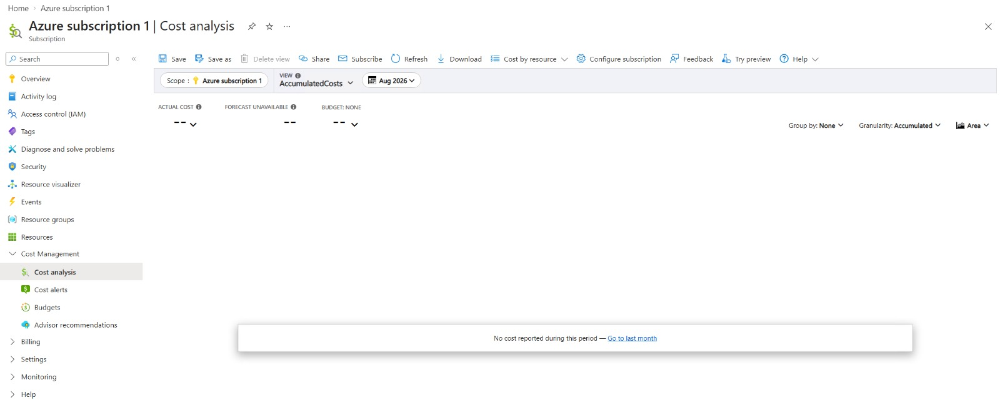
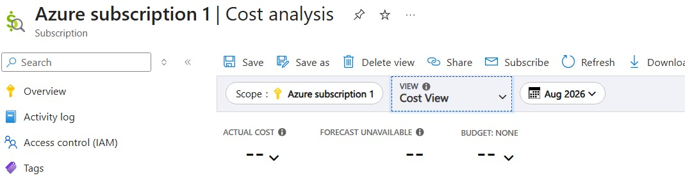
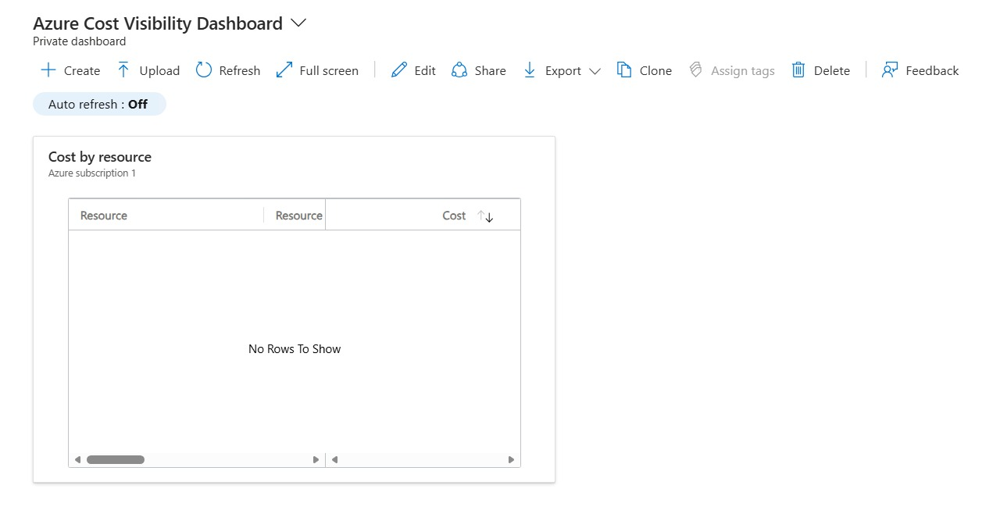
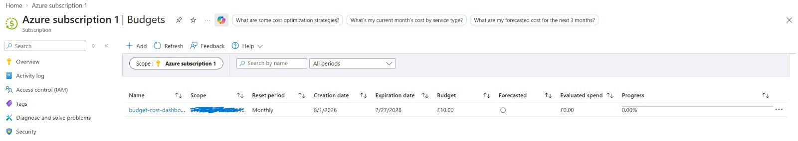
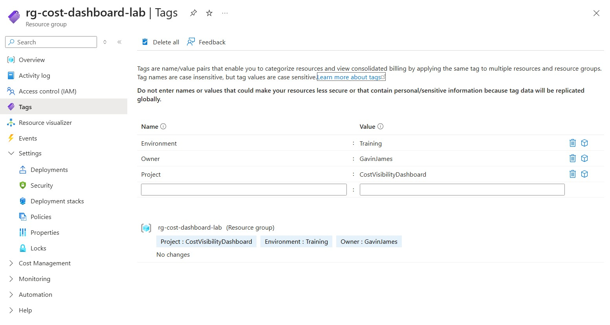
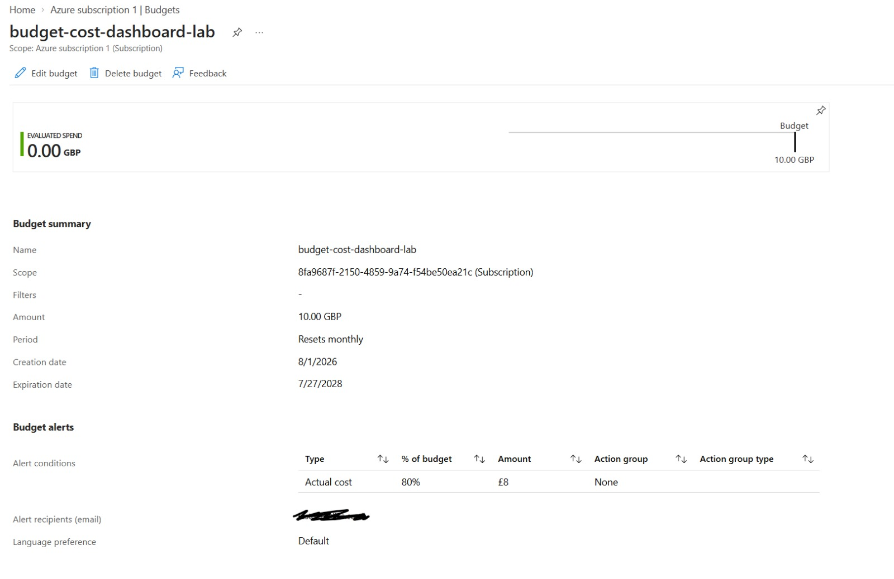

# Project 01 - Azure Cost Visibility Dashboard

## Project Overview

This project was completed alongside my Microsoft Azure Administrator (AZ-104) training.

The goal was to create a simple cost-management solution that provides visibility into Azure spending, monitors costs against a monthly budget, and sends an alert when spending reaches a defined threshold.

## Scenario

BrightPath Solutions is beginning its Azure journey and needs a straightforward way to monitor cloud spending.

As the Junior Azure Administrator, I was asked to:

- Organise the project using a dedicated resource group
- Review subscription costs using Cost Analysis
- Create a reusable cost view
- Configure a monthly budget
- Configure a budget alert
- Display cost information on an Azure dashboard
- Apply resource tags to help organise the training environment

## Azure Resources and Configuration

| Item | Configuration |
| --- | --- |
| Subscription | Azure Subscription 1 |
| Resource group | `rg-cost-dashboard-lab` |
| Region | UK South |
| Dashboard | Azure Cost Visibility Dashboard |
| Cost view | Cost by resource |
| Budget | `budget-cost-dashboard-lab` |
| Budget period | Monthly |
| Alert threshold | 80% of actual cost |

## Resource Tags

The following tags were applied to help organise and identify the project:

| Tag | Value |
| --- | --- |
| Project | CostVisibilityDashboard |
| Environment | Training |
| Owner | GavinJames |

## Implementation

### 1. Accessed Azure Cost Analysis

I opened Cost Analysis at the subscription scope to review spending and cost information.

### 2. Configured a Cost View

I used Cost Analysis to examine Azure costs by resource and created a reusable cost view.

### 3. Created the Cost Dashboard

I created a private Azure dashboard named **Azure Cost Visibility Dashboard** and pinned the **Cost by resource** view to it.

### 4. Created a Monthly Budget

I created a monthly budget named `budget-cost-dashboard-lab` to monitor subscription spending.

### 5. Applied Resource Tags

I applied tags to the resource group to help identify the project, environment and owner.

### 6. Configured a Budget Alert

I configured an actual-cost alert at 80% of the monthly budget.

## Skills Demonstrated

- Navigating the Azure portal
- Working with Azure subscriptions
- Creating and tagging resource groups
- Using Azure Cost Management
- Analysing costs by resource
- Creating reusable cost views
- Creating monthly budgets
- Configuring budget alerts
- Creating an Azure dashboard
- Documenting an Azure project for GitHub

## Key Learning Outcomes

This project provided hands-on experience with:

- Monitoring Azure subscription costs
- Organising resources using tags
- Creating reusable Cost Analysis views
- Using budgets and alerts to monitor cloud spending
- Presenting cost information through an Azure dashboard

## Important Notes

- The subscription had no reported resource costs when the project was completed, so some views showed no cost data.
- Azure budgets provide notifications but do not automatically stop or remove resources.
- Sensitive information such as subscription IDs, tenant IDs and email addresses has been excluded from the documentation.

## AZ-104 Alignment

This project supports AZ-104 skills relating to:

- Azure resource management
- Resource tagging and organisation
- Azure Cost Management
- Monitoring Azure resource usage and expenditure

## Conclusion

This project demonstrates a basic Azure cost-governance solution. It provides a central dashboard for cost visibility and uses a monthly budget alert to help identify unexpected spending.
