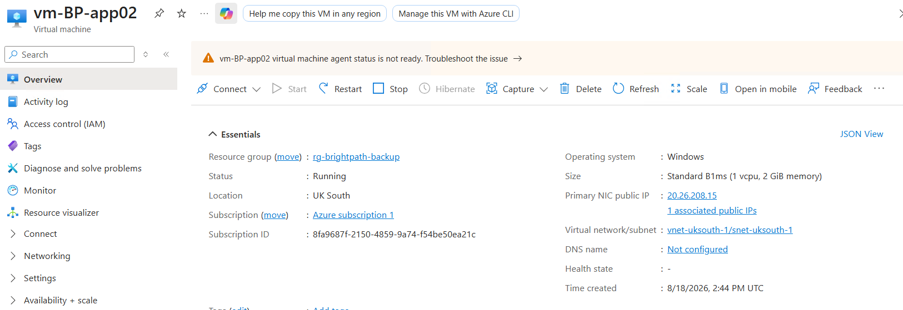
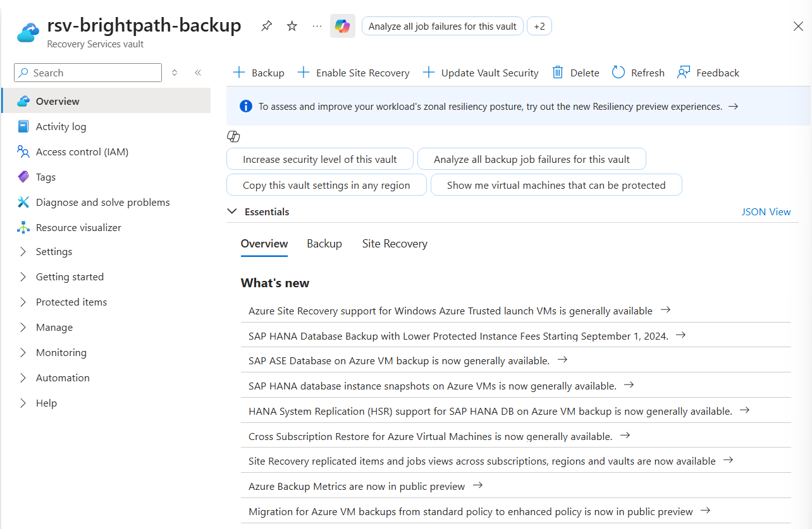
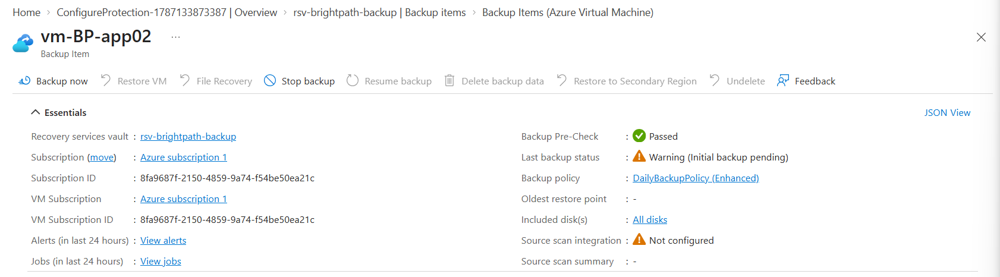
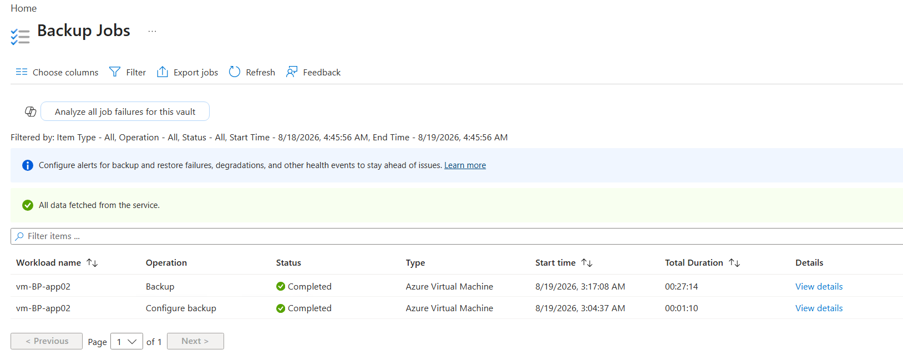
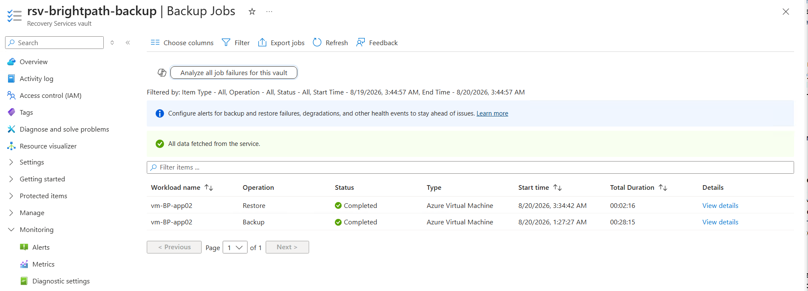

# Project 02 - Automated Backup System

## Project Overview

This project was completed as part of my Microsoft Azure Administrator (AZ-104) hands-on training.

The goal was to implement and test an automated Azure Backup solution for a business-critical virtual machine, providing recovery capabilities in the event of data loss or infrastructure failure.

## Scenario

BrightPath Solutions is a growing IT consultancy that hosts critical business applications on Azure Virtual Machines.

To protect company data and support business continuity, BrightPath Solutions requires an automated backup solution that can recover systems following accidental deletion, data corruption, ransomware attacks or infrastructure failures.

As the Junior Cloud Administrator, I was tasked with implementing and testing an Azure Backup solution that provides automated protection for business-critical workloads.

## Project Objectives

- Create a Recovery Services Vault
- Configure Azure VM backup
- Create and apply a backup policy
- Schedule automatic daily backups
- Verify backup jobs complete successfully
- Perform a test restore
- Document the solution

## Technologies Used

- Microsoft Azure
- Azure Virtual Machines
- Recovery Services Vault
- Azure Backup
- Azure Monitor

## Implementation

### 1. Created the Resource Group

A dedicated Azure resource group was created to organise the resources used for the backup solution.

### 2. Deployed the Azure Virtual Machine

An Azure virtual machine was deployed to represent a business-critical BrightPath workload requiring backup protection.

### 3. Created the Recovery Services Vault

A Recovery Services Vault was deployed to provide centralised management of backup and recovery operations.

### 4. Enabled VM Backup

Azure Backup was configured for the virtual machine using a backup policy.

The configuration provided:

- Daily automated backups
- Centralised backup management
- Recovery point retention
- Restore and recovery capabilities

### 5. Validated the Backup

A manual backup was initiated to verify that the backup configuration was functioning correctly.

The validation confirmed:

- Backup policy successfully applied
- Backup job completed successfully
- Recovery point created
- VM protection verified

### 6. Tested Restore Capability

A restore operation was tested to validate that the protected workload could be recovered using an available recovery point.

## Architecture

The solution was designed to provide automated protection for an Azure virtual machine.

### Components

- Azure Resource Group
- Azure Virtual Machine
- Recovery Services Vault
- Azure Backup Policy
- Recovery Points
- Restore Operations

### Workflow

1. Azure VM deployed
2. Recovery Services Vault created
3. Backup policy configured
4. Daily backups scheduled
5. Recovery points generated
6. Restore operation tested

## Deployment Troubleshooting

Initial VM deployments using **Windows Server 2022** and the **Standard_B1s** size failed with an `InternalOperationError` during provisioning.

After troubleshooting, the deployment was successfully completed using:

- Windows Server 2019 Datacenter
- Standard_B1ms VM size
- UK South region

This provided practical experience troubleshooting Azure VM provisioning issues and adapting deployment options when the original configuration failed.

## Skills Demonstrated

- Azure Administration
- Azure Virtual Machine deployment
- Azure Backup configuration
- Recovery Services Vault management
- Backup policy configuration
- Recovery point management
- Backup and restore validation
- Business continuity concepts
- Azure deployment troubleshooting
- Technical documentation

## Key Learning Outcomes

This project provided hands-on experience with:

- Protecting Azure VMs using Azure Backup
- Managing backups through a Recovery Services Vault
- Applying backup policies to Azure workloads
- Verifying successful backup jobs and recovery points
- Testing restore operations
- Troubleshooting Azure VM deployment failures

## AZ-104 Alignment

This project supports AZ-104 skills relating to:

- Azure Virtual Machines
- Azure Backup
- Recovery Services Vaults
- Backup policies
- Backup and restore operations
- Business continuity and workload protection

## Conclusion

This project demonstrates the implementation and validation of an automated Azure Backup solution for BrightPath Solutions.

The solution successfully protected the Azure virtual machine, created recovery points and demonstrated the ability to restore the protected workload when required.
