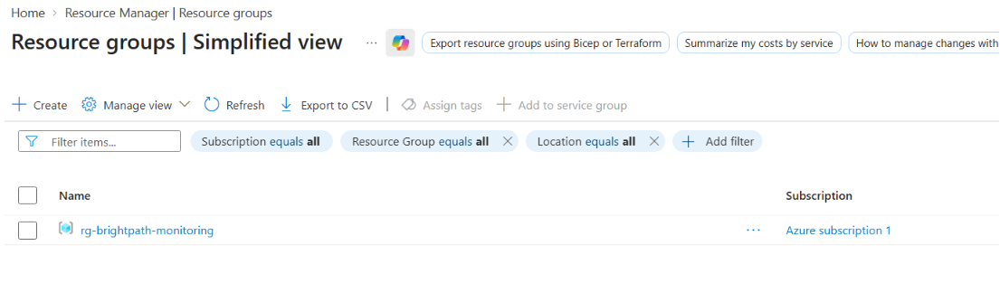
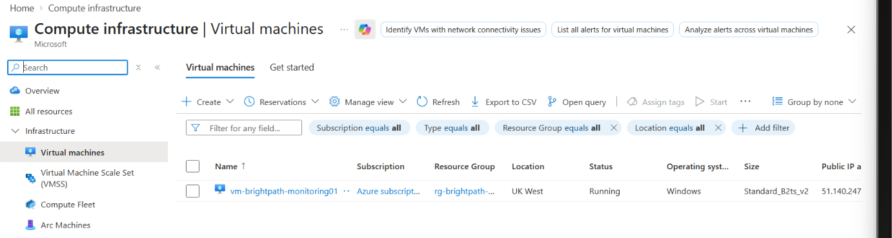
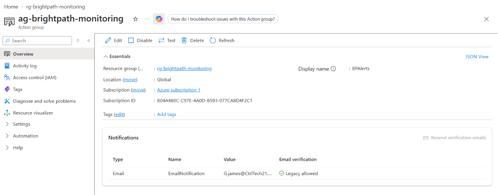
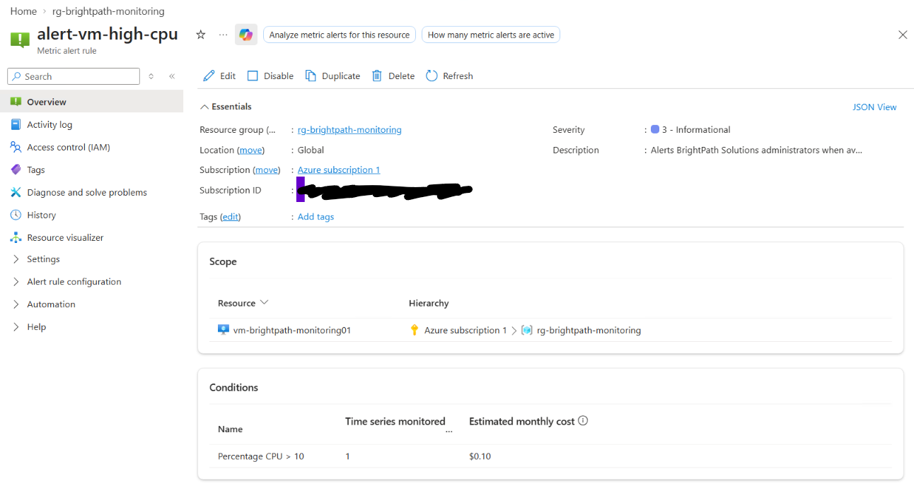
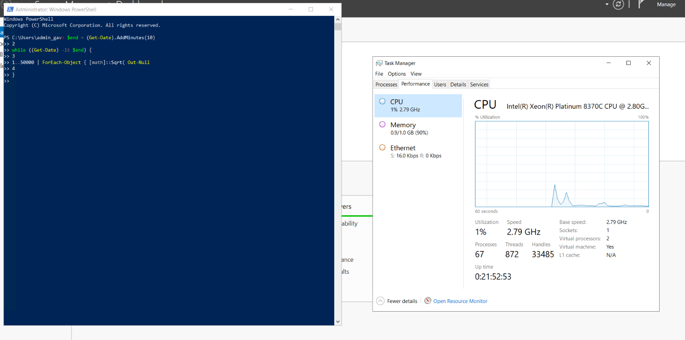
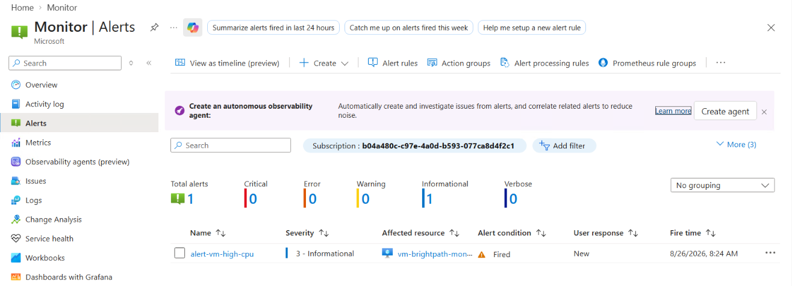
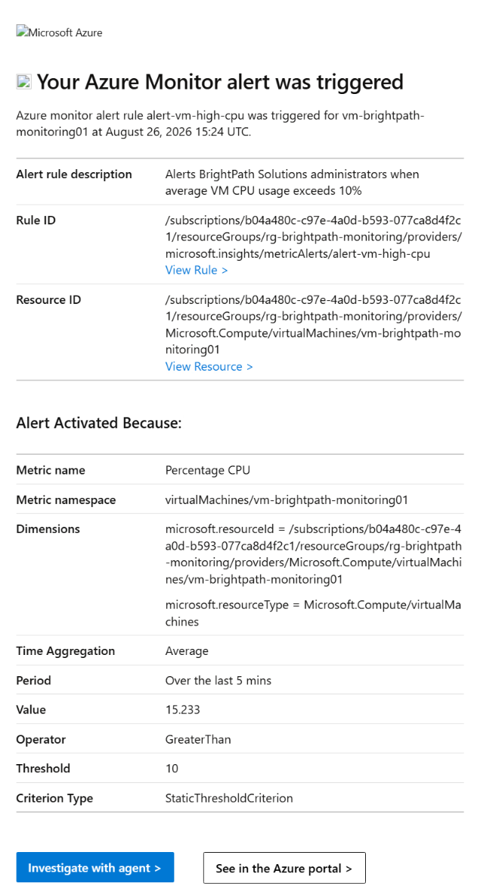
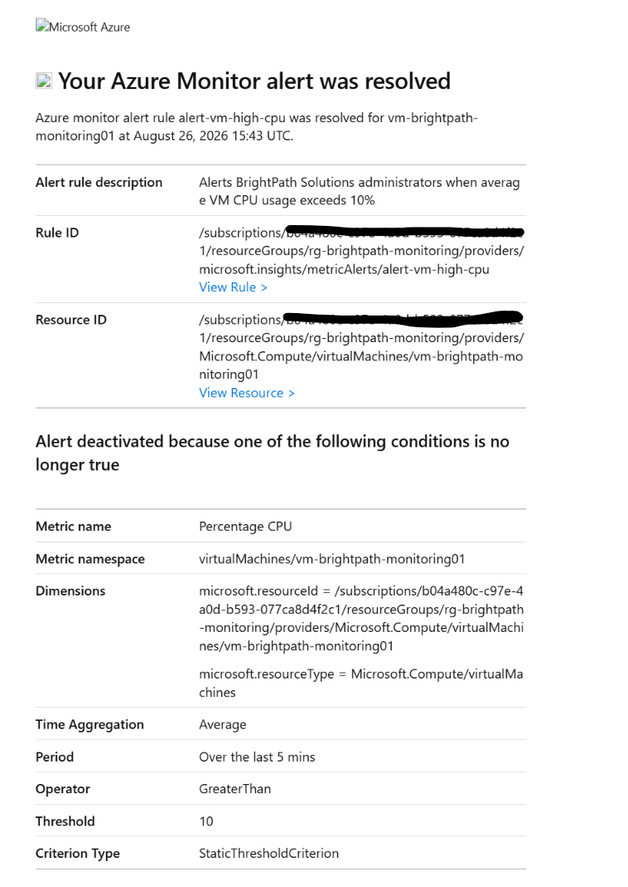

# Project 03 - Monitoring and Alerting System

## Project Overview

This project was completed as part of my Microsoft Azure Administrator (AZ-104) hands-on training.

The goal was to implement a monitoring and alerting solution using Azure Monitor to detect performance issues, generate alerts and notify administrators when predefined conditions were met.

## Scenario

BrightPath Solutions has implemented backup protection for critical workloads hosted in Azure.

To improve operational visibility and reduce response times to service issues, the company requires a monitoring and alerting solution.

As the Junior Cloud Administrator, I was tasked with implementing Azure monitoring capabilities to track virtual machine performance, generate alerts and support proactive incident management.

## Project Objectives

- Configure Azure Monitor
- Create an Action Group
- Configure a metric Alert Rule
- Monitor virtual machine CPU utilisation
- Generate and test an alert
- Configure email notifications
- Validate the alert lifecycle from Fired to Resolved
- Document the monitoring solution

## Technologies Used

- Microsoft Azure
- Azure Monitor
- Azure Virtual Machines
- Azure Monitor Action Groups
- Azure Monitor Metric Alerts
- Azure Resource Providers

## Implementation

### 1. Created the Monitoring Resource Group

A dedicated resource group named `rg-brightpath-monitoring` was created to organise the Azure resources used for the monitoring and alerting solution.

### 2. Deployed the Monitoring Virtual Machine

The virtual machine `vm-brightpath-monitoring01` was deployed to provide a workload that could be monitored using Azure Monitor.

The VM was later used to generate CPU activity so that the monitoring and alerting configuration could be tested.

### 3. Created the Action Group

An Azure Monitor Action Group named `ag-brightpath-monitoring` was configured with an email notification.

The Action Group provides the notification mechanism used when the monitoring alert changes state.

### 4. Created the CPU Alert Rule

A metric alert named `alert-vm-high-cpu` was configured to monitor the **Percentage CPU** metric of the BrightPath virtual machine.

For testing purposes, the alert threshold was configured as:

- Metric: Percentage CPU
- Operator: Greater than
- Threshold: 10%
- Severity: 3 - Informational
- Notification: Azure Monitor Action Group

The deliberately low threshold made it practical to trigger and validate the alert during the lab.

### 5. Generated CPU Load

PowerShell was used inside the virtual machine to generate CPU activity.

This provided a controlled way to increase CPU utilisation and test whether Azure Monitor would detect the configured threshold condition.

### 6. Validated the Triggered Alert

After the CPU threshold was exceeded, Azure Monitor detected the condition and changed `alert-vm-high-cpu` to the **Fired** state.

This confirmed that the metric alert was successfully evaluating the virtual machine's CPU utilisation.

### 7. Validated the Email Notification

The configured Action Group sent an Azure Monitor email notification confirming that the high-CPU alert had been triggered.

The notification identified the affected virtual machine and showed that the Percentage CPU metric had exceeded the configured 10% threshold.

### 8. Validated Alert Resolution

After CPU utilisation returned below the configured threshold, Azure Monitor automatically changed the alert from **Fired** to **Resolved**.

A second email notification confirmed that the alert condition was no longer active, validating the complete monitoring lifecycle.

## Troubleshooting

### VM Deployment Challenges

During implementation, several virtual machine deployment issues were encountered.

Initial attempts to deploy using some B-series and D-series VM sizes resulted in availability and subscription quota errors.

Errors included:

`NotAvailableForSubscription`

and insufficient family vCPU quota.

Investigation showed that some VM families had a subscription quota allocation of **0 of 0 vCPUs**.

Troubleshooting included:

- Reviewing VM size availability
- Testing alternative VM families
- Investigating subscription quota limitations
- Reviewing Azure quotas under Microsoft.Compute
- Identifying VM family restrictions

This demonstrated the importance of checking regional availability and subscription quotas when deploying Azure compute resources.

### Microsoft.Insights Resource Provider

An additional issue occurred when attempting to create the Azure Monitor Action Group.

Azure reported that the subscription was not registered to use the `Microsoft.Insights` namespace.

The issue was resolved by:

1. Opening Resource Providers within the Azure subscription
2. Locating `Microsoft.Insights`
3. Registering the resource provider
4. Retrying the Action Group deployment

After registration, the Action Group was created successfully and email notifications could be configured.

## Skills Demonstrated

- Azure Administration
- Azure Monitor
- Virtual Machine monitoring
- Metric Alert configuration
- Action Group configuration
- Email alert notifications
- Alert testing and validation
- Azure Resource Provider troubleshooting
- Azure subscription quota troubleshooting
- Incident monitoring
- Technical documentation

## Key Learning Outcomes

This project provided hands-on experience with:

- Monitoring Azure VM performance
- Creating metric-based Azure Monitor alerts
- Using Action Groups for administrator notifications
- Generating test conditions to validate monitoring
- Understanding Fired and Resolved alert states
- Troubleshooting Azure Resource Provider registration
- Troubleshooting VM availability and subscription quota restrictions

## AZ-104 Alignment

This project supports AZ-104 skills relating to:

- Azure Monitor
- Azure Virtual Machine monitoring
- Metric alerts
- Action Groups
- Azure resource health and monitoring
- Troubleshooting Azure resource deployments

## Conclusion

This project demonstrates the implementation of an Azure monitoring and alerting solution for BrightPath Solutions.

The completed solution monitored virtual machine CPU utilisation, detected a defined performance condition, triggered an Azure Monitor alert, notified administrators through an Action Group and automatically resolved the alert when the monitored resource returned to normal operating conditions.
