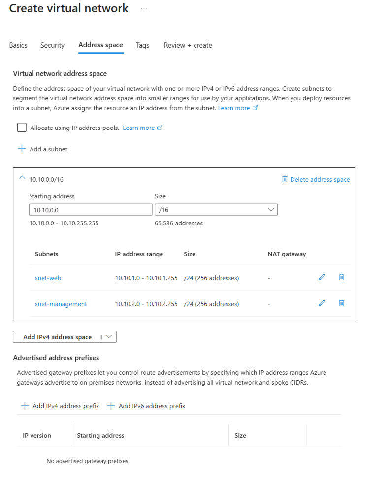
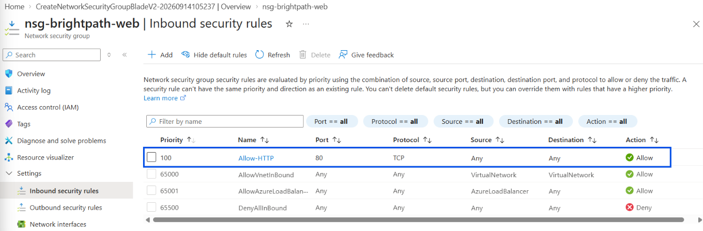
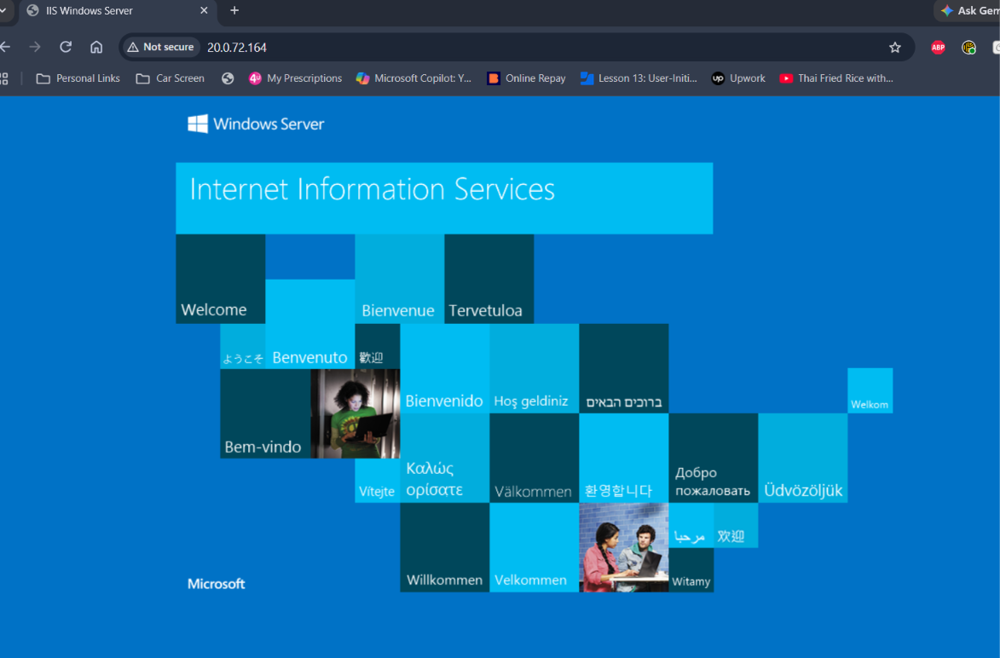
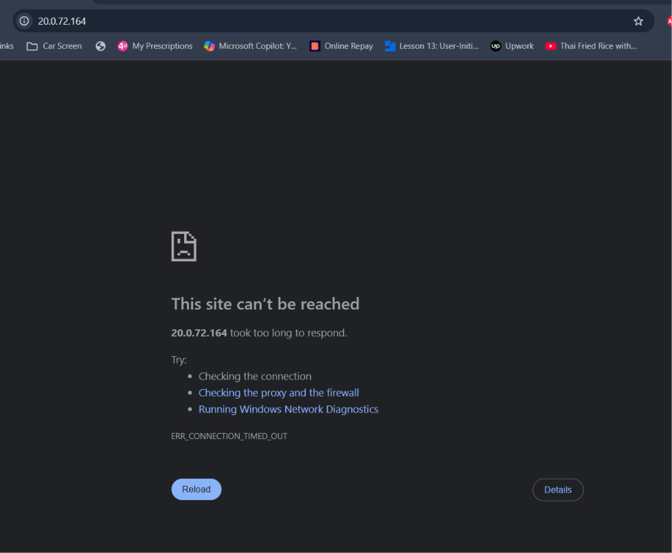
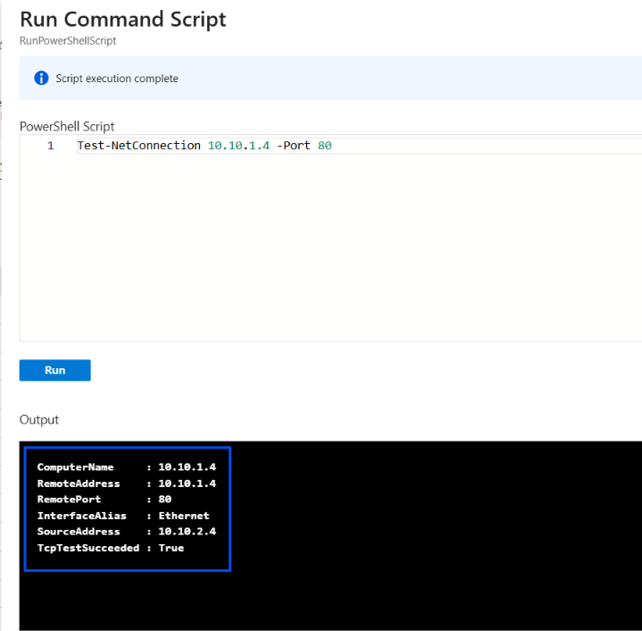
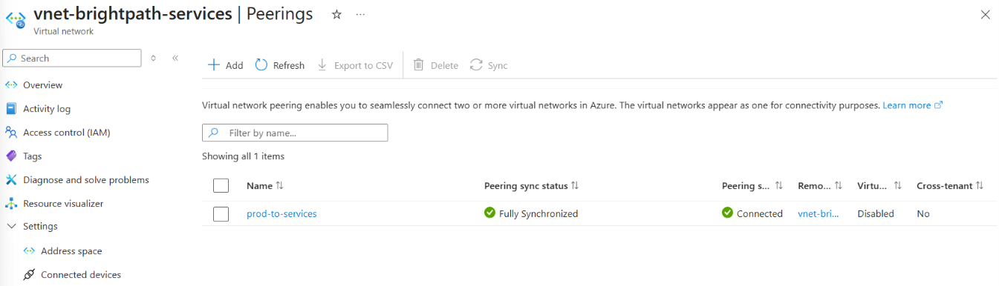
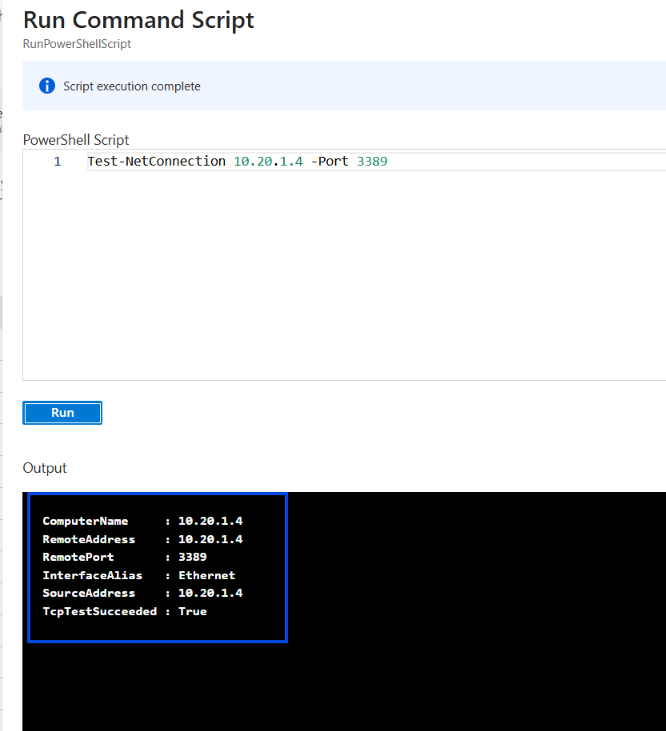

# Project 05 - Azure Virtual Networking

## Project Overview

In this project, I designed and configured a virtual networking environment in Microsoft Azure for the fictional company BrightPath Solutions.

The project demonstrates core Azure networking concepts including virtual networks, subnets, Network Security Groups (NSGs), private IP communication, VNet peering, routing, DNS, private connectivity, and outbound connectivity.

## Objectives

- Create and configure an Azure Virtual Network (VNet)
- Design multiple subnets using private IP address ranges
- Configure and associate a Network Security Group (NSG)
- Create inbound security rules
- Deploy Azure virtual machines into different subnets
- Test HTTP access to an IIS web server
- Demonstrate NSG Allow and Deny behaviour
- Test private communication between subnets
- Configure VNet peering between separate VNets
- Verify private connectivity across peered VNets
- Understand Azure routing, DNS, Service Endpoints, Private Endpoints, and NAT Gateway

## Azure Resources

### Production Network

- Virtual Network: `vnet-brightpath-prod`
- Address Space: `10.10.0.0/16`
- Web Subnet: `snet-web` - `10.10.1.0/24`
- Management Subnet: `snet-management` - `10.10.2.0/24`
- Network Security Group: `nsg-brightpath-web`

### Services Network

- Virtual Network: `vnet-brightpath-services`
- Address Space: `10.20.0.0/16`
- Services Subnet: `snet-services` - `10.20.1.0/24`

## Implementation

### 1. Virtual Network and Subnets

Created the production VNet and divided the address space into separate web and management subnets.

### 2. Network Security Group

Created `nsg-brightpath-web`, associated it with the web subnet, and configured an inbound rule allowing HTTP traffic on TCP port 80.

### 3. IIS Web Server Test

Deployed a Windows Server VM into the web subnet and installed IIS. HTTP connectivity was successfully verified.

### 4. NSG Deny Test

Changed the HTTP security rule from Allow to Deny. The website became unreachable, demonstrating how NSG rules control network traffic. The rule was then restored to Allow.

### 5. Private Subnet Communication

Deployed a management VM into a separate subnet and tested TCP port 80 connectivity to the web VM using its private IP address.

The test returned `TcpTestSucceeded : True`, confirming successful private communication between subnets in the same VNet.

### 6. VNet Peering

Created a second VNet with a non-overlapping address space and configured VNet peering between the production and services networks.

The peering status showed Connected.

### 7. Peering Connectivity Test

Deployed a VM into the services VNet and tested connectivity across the peering connection using private IP addresses.

The test returned `TcpTestSucceeded : True`, confirming successful private communication between the two VNets.

## Key Learning Outcomes

- VNets provide private networking for Azure resources.
- Subnets divide a VNet into smaller network segments.
- Azure automatically routes traffic between subnets within the same VNet.
- NSGs control whether inbound and outbound network traffic is allowed or denied.
- Lower NSG priority numbers are processed before higher numbers.
- Route tables and User-Defined Routes (UDRs) control where traffic is routed.
- VNet peering connects separate VNets using private IP connectivity.
- Peered VNets must use non-overlapping address spaces.
- Service Endpoints secure VNet access to supported Azure services while retaining the service's public endpoint.
- Private Endpoints provide supported Azure services with private IP connectivity through the VNet.
- NAT Gateway provides scalable outbound internet connectivity for resources in a subnet.

## Skills Demonstrated

Azure Virtual Networks | Subnetting | Network Security Groups | Azure VMs | IIS | Private IP Networking | VNet Peering | Azure Routing | UDRs | DNS | Private Endpoints | Service Endpoints | NAT Gateway

## AZ-104 Alignment

This project supports AZ-104 skills relating to implementing and managing virtual networking, including VNets, subnets, NSGs, routing, name resolution, private connectivity, and VNet peering.
