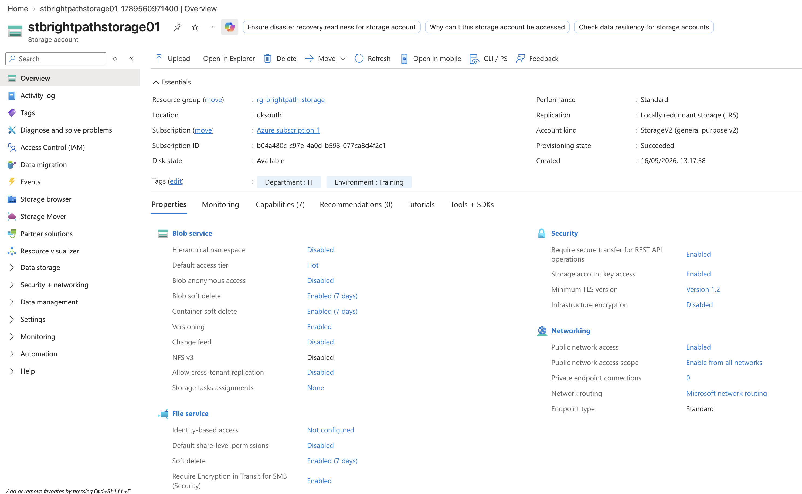
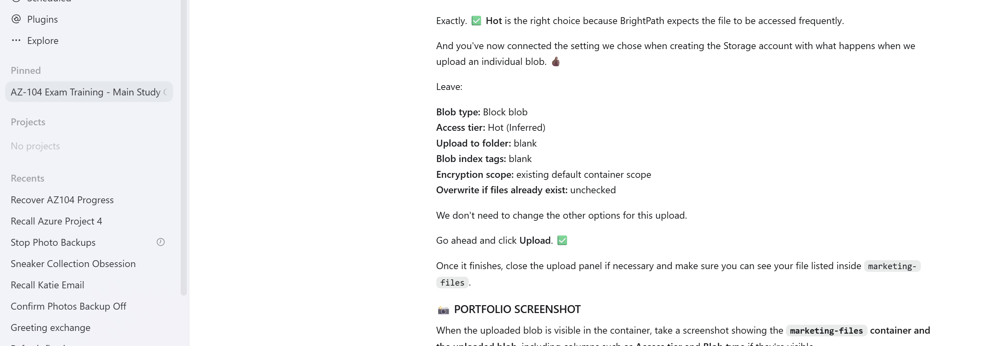
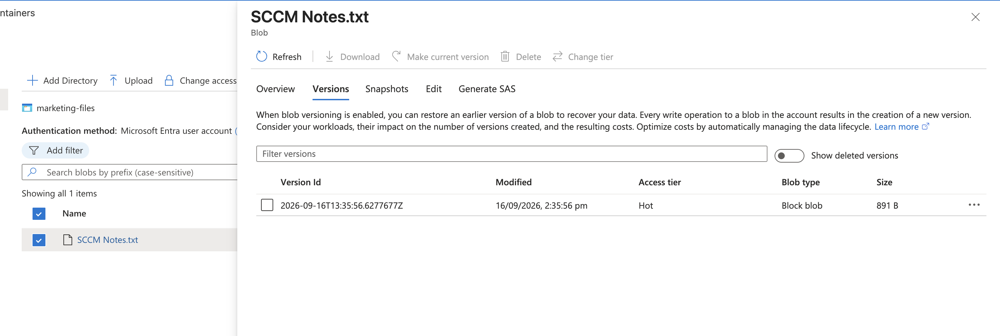
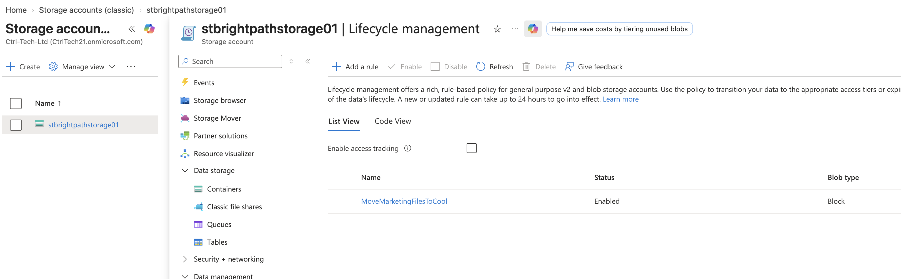

# Project 06 - Azure Storage

## Project Overview

In this project, I worked as a Junior Cloud Administrator for BrightPath Solutions to deploy, configure and test Azure Storage services.

The project focused on selecting appropriate storage services, securing access to storage data, protecting data from accidental deletion and modification, and managing storage efficiently.

## What I Implemented

- Created an Azure Storage account using Standard performance and LRS redundancy
- Configured Hot as the default Blob access tier
- Reviewed Azure Storage redundancy options including LRS, ZRS, GRS and GZRS
- Configured Blob and Container soft delete with a 7-day retention period
- Enabled Blob Versioning
- Required secure transfer and TLS 1.2
- Configured Microsoft Entra authorization as the preferred authorization method in the Azure portal
- Used Microsoft-managed keys for encryption at rest
- Created a private Blob container named `marketing-files`
- Uploaded and managed a Block Blob
- Assigned the Storage Blob Data Contributor RBAC role for data-plane access
- Tested Blob Versioning by overwriting and recovering a previous version
- Tested recovery after deleting a blob
- Generated and tested a read-only Shared Access Signature (SAS) with an expiry time
- Created an Azure Files share named `finance-share`
- Created a Lifecycle Management rule to move blobs to the Cool tier after 30 days

## Key Skills Demonstrated

- Azure Storage account configuration
- Blob Storage
- Azure Files
- Storage redundancy
- Access tiers
- Microsoft Entra ID and Azure RBAC
- Management plane vs data plane permissions
- Shared Access Signatures (SAS)
- Blob soft delete and versioning
- Storage encryption
- Secure transfer and TLS
- Lifecycle Management
- Least-privilege access

## Screenshots

### Storage Account Overview

### Blob Container and Upload

### Blob Versioning

### Lifecycle Management

## Project Outcome

Successfully deployed and configured an Azure Storage environment for BrightPath Solutions.

The project demonstrated how Azure Storage can be configured to provide secure data access, protect against accidental deletion and modification, provide temporary delegated access using SAS, support traditional file shares using Azure Files, and automatically manage Blob access tiers using Lifecycle Management.
