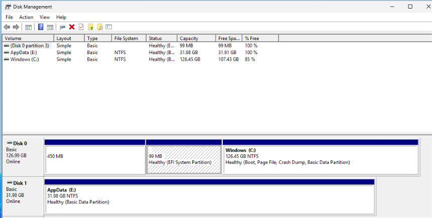
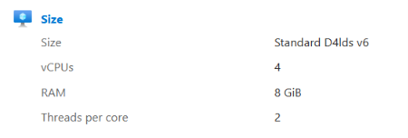
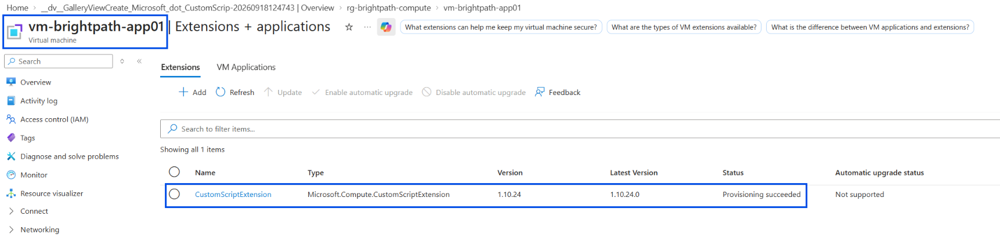
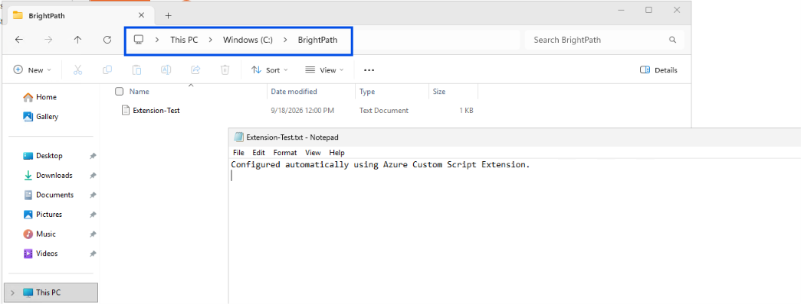

# Project 07 - Azure Compute and VM Management

## Project Overview

In this project, I worked as a Junior Cloud Administrator for BrightPath Solutions to deploy and manage an Azure Windows virtual machine.

The project focused on core Azure compute administration tasks including virtual machine deployment, managed disks, VM resizing, availability concepts, scaling and post-deployment automation using VM extensions.

## Objectives

- Deploy and configure an Azure Windows virtual machine
- Understand Azure VM availability options
- Understand VM scaling and Virtual Machine Scale Sets
- Attach and configure an Azure managed data disk
- Understand different managed disk types
- Resize an Azure VM to increase CPU and memory
- Understand Azure Load Balancer and health probes
- Use Azure Custom Script Extension for post-deployment automation

## Resources Created

- Resource Group: `rg-brightpath-compute`
- Virtual Machine: `vm-brightpath-app01`
- Operating System: Windows Server 2025
- Managed Data Disk: `disk-brightpath-appdata01`
- Data Volume: `E: AppData`
- Temporary Azure Storage account and Blob container for the Custom Script Extension

## VM Availability

I reviewed different Azure options for improving virtual machine availability.

### Availability Zones

Availability Zones are physically separate locations within an Azure region with independent power, cooling and networking.

Deploying VMs across multiple Availability Zones can reduce the risk of a single datacenter failure affecting an application.

### Availability Sets

Availability Sets distribute VMs across fault domains and update domains.

- Fault domains help protect against underlying hardware failures.
- Update domains help prevent planned Azure maintenance from affecting all VMs at the same time.

## Scaling

I reviewed vertical and horizontal scaling options for Azure virtual machines.

- Scale up/down changes the CPU and memory resources of an individual VM.
- Scale out/in changes the number of VM instances.

Virtual Machine Scale Sets can deploy and manage multiple VM instances and support automatic scaling based on demand.

## VM Resizing

The development VM was initially deployed with:

- 2 vCPUs
- 4 GB RAM

The VM was then scaled up to:

- 4 vCPUs
- 8 GB RAM

This demonstrated how an existing Azure VM can be resized when additional compute resources are required.

## Managed Disks

A separate managed data disk was attached to the virtual machine.

Inside Windows Server, the new disk was:

1. Initialised using GPT
2. Partitioned
3. Formatted using NTFS
4. Assigned the available drive letter `E:`
5. Labelled `AppData`

This demonstrated that attaching a managed disk in Azure is only part of the process. The operating system must also initialise and prepare the disk before it can be used.

I also reviewed common Azure managed disk types:

- Standard HDD - lower-cost storage for less performance-sensitive workloads
- Standard SSD - general-purpose workloads
- Premium SSD - higher-performance production workloads

## VM Storage Types

- OS Disk - contains the virtual machine operating system.
- Data Disk - provides persistent storage for applications and data.
- Temporary Disk - local temporary storage where data is not guaranteed to persist.

## Load Balancing

Azure Load Balancer can distribute network traffic across multiple backend virtual machines.

Health probes monitor backend resources and help prevent traffic from being sent to unhealthy instances.

## VM Extensions and Automation

Azure VM Extensions provide post-deployment configuration and automation capabilities.

For this project, I used the Custom Script Extension to execute a PowerShell script on the Windows VM.

The PowerShell script automatically:

- Created `C:\BrightPath`
- Created `Extension-Test.txt`
- Added a test message to the file

The script was stored in a private Azure Blob Storage container and selected during the Custom Script Extension configuration.

After deployment, the extension reported `Provisioning succeeded`, and the generated file was verified inside the Windows VM.

## Screenshots

### Managed Data Disk

### VM Resize

### Custom Script Extension

### Extension Result

## Skills Demonstrated

- Azure Virtual Machines
- Windows Server Administration
- Azure Managed Disks
- VM Sizing and Resizing
- Availability Zones
- Availability Sets
- Virtual Machine Scale Sets
- Azure Load Balancer
- Health Probes
- Azure VM Extensions
- PowerShell Automation
- Azure Blob Storage
- Azure Portal Administration
