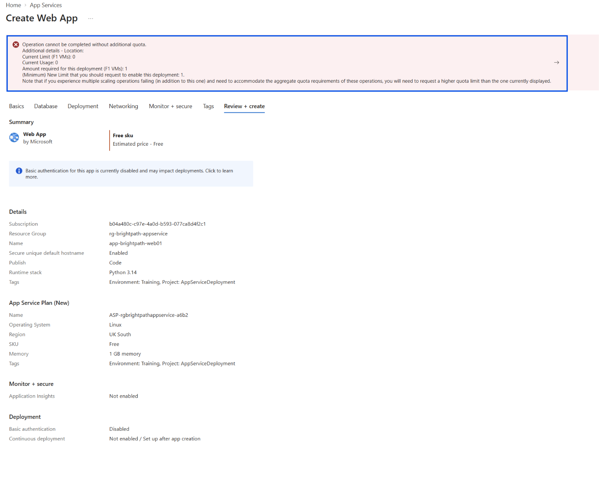
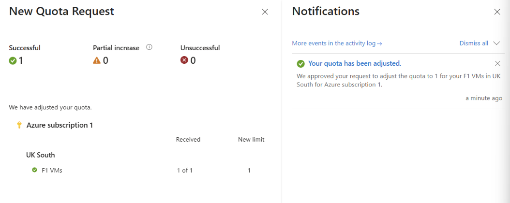
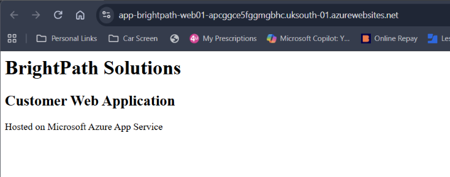
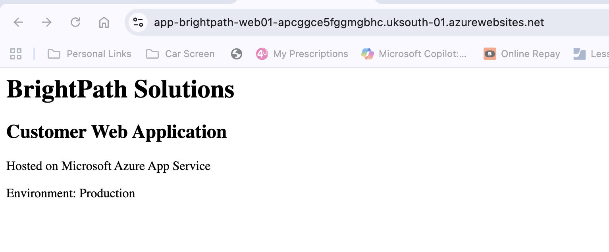
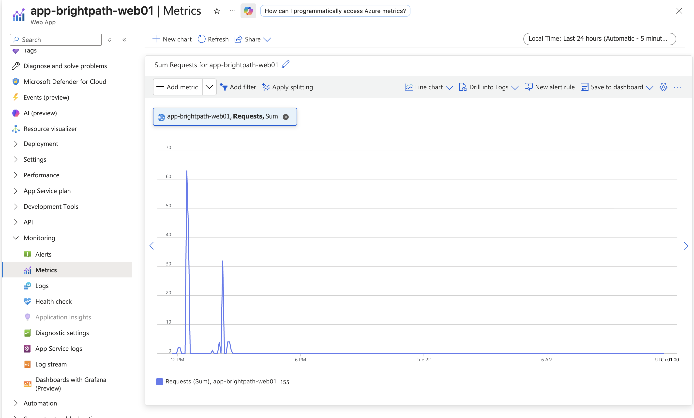

# Project 08 - Azure App Service and Application Deployment

## Project Overview

This project demonstrates the deployment, configuration, monitoring, and troubleshooting of a web application using Microsoft Azure App Service.

The project was designed around a fictional company, BrightPath Solutions, which required a customer-facing web application without the administrative overhead of maintaining virtual machines, Windows Server, or IIS.

The solution uses Azure App Service as a Platform as a Service (PaaS) offering, allowing the application to run on Azure-managed infrastructure.

---

## Scenario

BrightPath Solutions required a public-facing customer web application.

The IT team wanted to avoid deploying and maintaining another virtual machine and instead required a managed Azure platform that could:

- Host the web application
- Provide public internet access
- Support application configuration
- Provide monitoring and diagnostic capabilities
- Support scaling as demand increases
- Allow safer application releases using deployment slots on supported tiers

Azure App Service was selected to meet these requirements.

---

## Objectives

- Deploy an Azure Web App using Azure App Service
- Configure an App Service Plan
- Deploy a Python web application
- Configure application environment variables
- Monitor application traffic using Azure Monitor Metrics
- Use Log Stream for application and platform diagnostics
- Understand scale up, scale out, and autoscale
- Understand staging and production deployment slots
- Troubleshoot App Service deployment and configuration problems

---

## Technologies Used

- Microsoft Azure
- Azure App Service
- App Service Plans
- Azure Monitor
- Azure Metrics
- App Service Log Stream
- Python
- Flask
- Azure Resource Groups
- Azure Quotas
- Environment Variables

---

## Implementation

### 1. App Service Deployment and F1 Quota Troubleshooting

A Linux Azure Web App was configured in the UK South region using Python 3.14.

To minimise costs during the training project, the Free F1 App Service Plan was selected.

The initial deployment failed even though the Web App configuration had passed validation. Azure reported that the subscription had an F1 VM quota limit of 0 in UK South, while the deployment required a quota of 1.

The App Service quota was investigated through Azure Quotas. A quota increase from 0 to 1 F1 VM was requested for UK South and approved.

The original deployment was then retried successfully without changing region or upgrading to a paid App Service Plan.

---

### 2. BrightPath Web Application Deployment

A simple Python Flask web application was created for BrightPath Solutions.

The application was packaged with its `requirements.txt` dependency file and deployed to Azure App Service using manual deployment.

The application was successfully made publicly accessible using the App Service default domain.

This demonstrated how Azure App Service can host application code without requiring the administrator to manage the underlying operating system or web server infrastructure.

---

### 3. Application Configuration with Environment Variables

An App Service environment variable named `APP_MODE` was created with the value:

`Production`

The Python application was updated to read this configuration from the Azure environment rather than hard-coding the environment into the application.

This demonstrated how application configuration can be separated from application code.

---

### 4. Environment Variable Troubleshooting

A configuration fault was introduced by changing the environment variable from:

`APP_MODE`

to:

`APP_MOD`

The application remained online but displayed:

`Environment: Not configured`

The issue was reproduced using both normal and Incognito browser sessions, helping rule out a browser or session-specific problem.

The App Service environment variables were then inspected and the incorrectly named variable was identified as the root cause.

The variable was corrected to `APP_MODE`, the configuration was applied, and the application was tested again.

The website successfully returned to:

`Environment: Production`

This demonstrated a structured troubleshooting process:

**Reproduce → Investigate → Identify Root Cause → Fix → Verify**

---

### 5. Application Monitoring

Azure Monitor Metrics was used to monitor traffic to the BrightPath application.

The **Requests** metric with **Sum** aggregation displayed HTTP request activity generated while accessing and testing the application.

Additional metrics such as HTTP Server Errors can be used alongside request data to investigate application failures and identify whether errors correspond with periods of increased traffic.

---

### 6. Application Logging and Diagnostics

App Service Log Stream was used to inspect live runtime information from the Linux App Service environment.

The logs provided visibility into:

- Python runtime startup
- App Service instance information
- Application port configuration
- Linux platform startup activity
- Runtime warnings and diagnostic information

This demonstrated how logs can provide deeper troubleshooting information when metrics indicate that a problem has occurred.

---

## Scaling and Availability

Azure App Service supports different approaches to scaling depending on the App Service Plan.

- **Scale Up** — Increase the compute resources available to the application.
- **Scale Out** — Increase the number of App Service instances.
- **Autoscale** — Automatically adjust instance capacity based on configured rules or workload demand.

The Free F1 tier was used for this training project to avoid unnecessary Azure costs, so advanced scaling capabilities were studied conceptually rather than enabled.

---

## Deployment Slots

Deployment slots provide separate environments such as staging and production.

A typical production deployment workflow would be:

1. Deploy the new application version to a staging slot.
2. Test and validate the application in staging.
3. Swap the staging slot with the production slot.
4. Monitor the new production version.
5. Swap back if rollback is required.

Deployment slots require a supported App Service Plan tier.

Because this project used the Free F1 tier for cost control, application code was deployed directly to the production app for training purposes.

---

## Troubleshooting Summary

Two App Service issues were investigated during this project.

### F1 Quota Deployment Failure

**Problem:** Web App deployment failed.

**Investigation:** Azure reported that the F1 VM quota for UK South was 0.

**Root Cause:** The subscription did not have sufficient F1 quota in the selected region.

**Resolution:** Requested and received an F1 quota increase from 0 to 1.

**Verification:** The Web App deployment completed successfully.

### Environment Variable Configuration Error

**Problem:** The application displayed `Environment: Not configured`.

**Investigation:** The issue was reproduced and App Service environment variables were inspected.

**Root Cause:** `APP_MODE` had been incorrectly changed to `APP_MOD`.

**Resolution:** Corrected the environment variable name.

**Verification:** The application returned to `Environment: Production`.

---

## Key Learning Outcomes

- Understood Azure App Service as a PaaS web-hosting solution
- Understood the relationship between a Web App and an App Service Plan
- Deployed a Python Flask application to Azure App Service
- Configured application settings using environment variables
- Used Azure Monitor Metrics to analyse application traffic
- Used Log Stream to investigate runtime activity
- Understood App Service scaling and autoscale concepts
- Understood staging and production deployment slots
- Diagnosed and resolved an Azure quota deployment failure
- Diagnosed and resolved an application configuration problem
- Practised evidence-based troubleshooting rather than making unverified configuration changes

---

## Skills Demonstrated

- Azure App Service Administration
- Web Application Deployment
- App Service Plan Configuration
- Azure Quota Management
- Application Configuration
- Azure Monitor
- Metrics Analysis
- Log Analysis
- Troubleshooting
- Cost-Aware Azure Administration

---

## AZ-104 Alignment

This project supports skills relevant to the Microsoft AZ-104 Azure Administrator certification, including:

- Deploying and managing Azure compute resources
- Configuring Azure App Service
- Monitoring Azure resources
- Configuring application settings
- Understanding scaling and availability options
- Troubleshooting Azure resource deployments and applications
- Managing Azure resources with cost considerations
