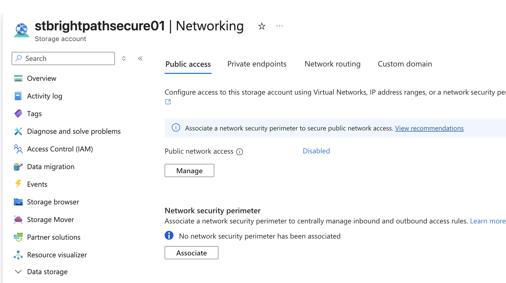
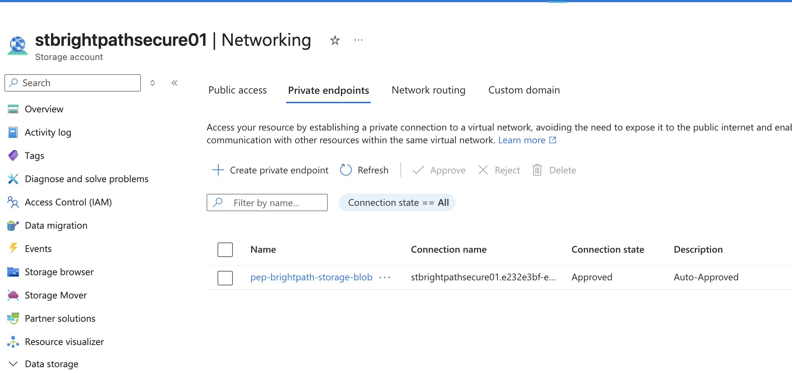
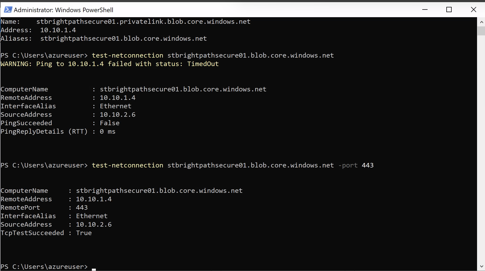

# Project 09 - Azure Network Security and Private Connectivity

## Project Overview

This project demonstrates how Azure Private Endpoints and Private DNS can be used to provide secure private connectivity to an Azure Storage account.

The project was designed around BrightPath Solutions, which required sensitive company data stored in Azure Storage to be accessible from internal Azure workloads without exposing the Storage account through the public network.

---

## Scenario

BrightPath Solutions stores sensitive internal company data in Azure Storage.

The security team required the Storage account to:

- Have public network access disabled
- Be accessible privately from resources inside the BrightPath Azure VNet
- Use a private IP address from the VNet
- Resolve the Storage hostname to the private endpoint IP
- Allow internal workloads to communicate with the Storage service securely

A Private Endpoint and Private DNS were implemented to meet these requirements.

---

## Objectives

- Create a secure Azure Virtual Network
- Configure separate subnets for private endpoints and workloads
- Deploy an Azure Storage account with public network access disabled
- Create a Private Endpoint for Azure Blob Storage
- Configure Private DNS integration
- Verify private DNS resolution
- Test HTTPS connectivity from an internal Azure VM
- Understand Private Endpoints vs Service Endpoints
- Reinforce VNet and subnet address planning

---

## Technologies Used

- Microsoft Azure
- Azure Virtual Network
- Azure Subnets
- Azure Storage
- Azure Blob Storage
- Azure Private Endpoint
- Azure Private Link
- Azure Private DNS
- Azure Virtual Machines
- PowerShell
- TCP/IP
- DNS

---

## Implementation

### 1. Secure Network Architecture

A dedicated Azure Virtual Network was created for the BrightPath environment.

**Virtual Network:**

`vnet-brightpath-secure`

**Address Space:**

`10.10.0.0/16`

Two separate subnets were created:

- `snet-private-endpoints` — `10.10.1.0/24`
- `snet-workloads` — `10.10.2.0/24`

The private endpoint subnet was used for private connectivity to Azure services, while the workload subnet was used for the internal test VM.

---

### 2. Storage Account Public Access Disabled

The BrightPath Storage account was configured with public network access disabled.

This prevents the Storage account from being accessed through the public network and ensures that the intended access path is through private connectivity.

---

### 3. Azure Private Endpoint

A Private Endpoint named:

`pep-brightpath-storage-blob`

was created for the Blob service of the BrightPath Storage account.

The Private Endpoint was deployed into:

`snet-private-endpoints`

Azure assigned the Private Endpoint the private IP address:

`10.10.1.4`

The private endpoint connection was successfully approved.

---

### 4. Private DNS Integration

A Private DNS Zone was created:

`privatelink.blob.core.windows.net`

The zone was linked to the BrightPath VNet.

An A record was automatically created for the Storage account, mapping its private Storage hostname to:

`10.10.1.4`

This allows resources inside the VNet to use the Storage account hostname while DNS directs the connection to the Private Endpoint.

---

### 5. Private Connectivity Testing

A Windows Server VM was deployed into:

`snet-workloads`

The VM was used to verify connectivity to the protected Storage account.

DNS resolution confirmed that the Storage account hostname resolved through Private DNS to:

`10.10.1.4`

A connectivity test initially showed that ICMP ping did not receive a response.

However, a TCP connectivity test to HTTPS port 443 succeeded:

`TcpTestSucceeded : True`

This demonstrated an important troubleshooting principle: a failed ping does not necessarily mean that the required application connection has failed.

The successful TCP 443 test confirmed that the workload VM could reach the Storage service through the private network path.

---

## Private Endpoint vs Service Endpoint

A Service Endpoint allows a subnet to securely access supported Azure services across the Microsoft Azure backbone, but the Azure service continues to use its public service endpoint.

A Private Endpoint provides the Azure service with a private IP address from the VNet.

For BrightPath, a Private Endpoint was selected because the requirement was to provide private IP-based access while disabling public network access to the Storage account.

---

## Troubleshooting and Validation

The private connectivity solution was validated using multiple pieces of evidence:

- Public network access was disabled on the Storage account
- The Private Endpoint connection was approved
- The Private Endpoint received `10.10.1.4` from the expected subnet
- Private DNS mapped the Storage hostname to `10.10.1.4`
- The workload VM used an address from `snet-workloads`
- DNS resolution from the VM returned the private endpoint address
- TCP connectivity to HTTPS port 443 succeeded

The testing also demonstrated why troubleshooting should focus on the protocol and port actually required by the application rather than relying only on ICMP ping.

---

## Key Learning Outcomes

- Understood how Azure Private Endpoints provide private IP connectivity to Azure services
- Understood the difference between Private Endpoints and Service Endpoints
- Configured a Storage account with public network access disabled
- Configured Private DNS for a Private Endpoint
- Verified DNS resolution to a private IP address
- Tested private HTTPS connectivity using PowerShell
- Reinforced VNet and subnet CIDR address planning
- Understood communication between subnets within the same VNet
- Practised evidence-based network troubleshooting

---

## Skills Demonstrated

- Azure Virtual Networking
- Azure Network Security
- Private Endpoints
- Azure Private Link
- Private DNS
- Azure Storage Networking
- Subnet Design
- DNS Resolution
- TCP Connectivity Testing
- PowerShell
- Network Troubleshooting

---

## AZ-104 Alignment

This project supports skills relevant to the Microsoft AZ-104 Azure Administrator certification, including:

- Configuring Azure Virtual Networks and subnets
- Securing access to Azure resources
- Configuring Private Endpoints
- Configuring Azure Private DNS
- Managing Azure Storage network access
- Understanding Service Endpoints and Private Endpoints
- Troubleshooting network connectivity
- Managing private access to Azure services
